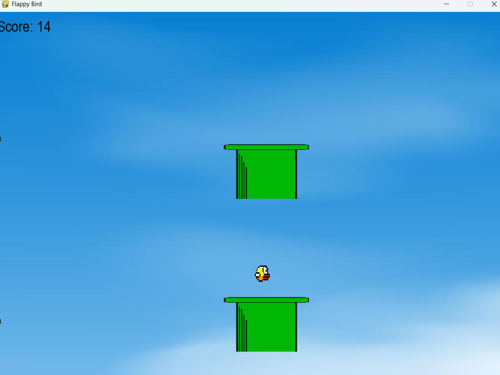

## 🐦 Flappy Bird Game

This is a recreation of the classic Flappy Bird game built in Python.
The player controls a bird, navigating it through pipes without crashing.

### Features

Simple keyboard controls to make the bird flap

Randomly generated pipes for endless gameplay

Score counter to track progress

